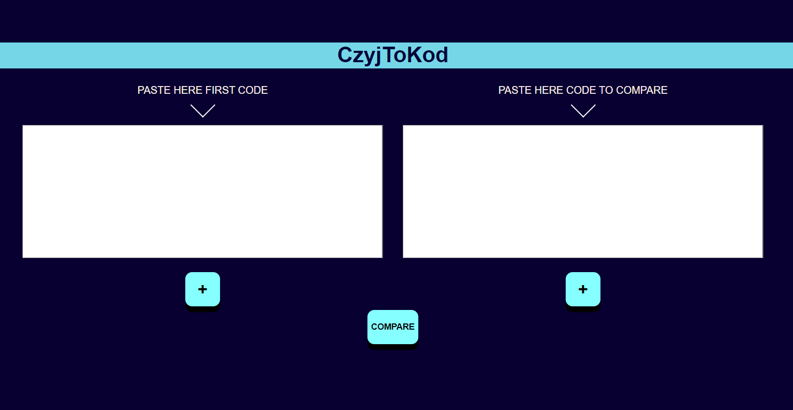

# Czyj to kod #
#### 1. Wprowadzenie

Celem projektu jest stworzenie aplikacji wykrywającej plagiat w kodzie źródłowym, opartej na algorytmach przeszukiwania wzorca. Aplikacja webowa pozwala na rozpoznanie
plagiatu w podanym przez użytkownika kodzie źródłowym. Program posiada następujące funkcjonalności:

- Dodawanie dwóch tekstów wprowadzonych przez użytkownika,

- Przetworzenie dwóch tekstów przez algorytm porównujący,

- Wyświetlenie statystyk podobieństwa tekstów.

Za podobne uważamy dwa fragmenty kodu, które są identyczne albo zbliżone do siebie wyglądem. Wykrywanie podobieństw w kodach programów jest
łatwiejsze niż w dowolnych tekstach pisanych. Powodem jest to, że w przypadku języków programowania znamy dokładnie pełną gramatykę. Podstawowe porównywanie kodu można podzielić ze względu na dwie metody:

- Porównywanie ciągów znaków - algorytm sprawdzający zgodność ciągów znaków jest szybki, ale ma dużą czułość na zmiany w porównywanych tekstach. Zmiana kolejności linii, nazw zmiennych itp. powoduje duże zakłócenia, algorytm uzna teksty za niepodobne do siebie. Z drugiej strony, porównywanie jedynie ciągów znaków daje największą szybkość przetwarzania.
- Porównywanie znaczników - algorytm poszukuje konkretnych struktur takich jak: słowa kluczowe dla języka, nazwy zmiennych, liczby, znaki specjalne. Na ich podstawie porównuje teksty, sprawdzając podobieństwo rozkładu znaczników, podobieństwo nazw zmiennych użytych w kodzie.

#### 2. Specyfikacja wewnętrzna
 Aplikacja została oparta o szablon Angular z ASP.NET Core. Napisana została w języku C\# oraz TypeScript.

Aplikacja od strony front-endu bazuje na dwóch głównych komponentach Angular: 

- **compare** - pozwala na wprowadzenie danych przez użytkownika i wysyła je dalej do przetworzenia.

- **stats** - wysyła informacje zwrotne o przeszukanym tekście, wyświetla statystyki porównywania kodów.

#### 3. Specyfikacja zewnętrzna

##### 3.1. Sposób uruchomienia programu

Program uruchamia się na serwerze lokalnym poprzez wpisanie w wierszu poleceń w folderze aplikacji *npm run start*.

##### 3.2. Format danych wejściowych

Dane wejściowe dla programu powinny być danymi tekstowymi. Użytkownik może wpisywać je z klawiatury lub skopiować w wyznaczone miejsce.

##### 3.3. Instrukcja obsługi

Po uruchomieniu programu użytkownik widzi dwa okna, w których należy wprowadzić porównywane ze sobą teksty. Każdy z nich zatwierdzony powinien zostać poprzez kliknięcie przycisku **+** pod każdym z nich.

Po wciśnięciu przycisku **COMPARE** program porówna teksty. Pod oknami wprowadzenia pojawią się statystyki przeszukanych kodów.

#### 4. Testowanie

#### 5. Wnioski 
